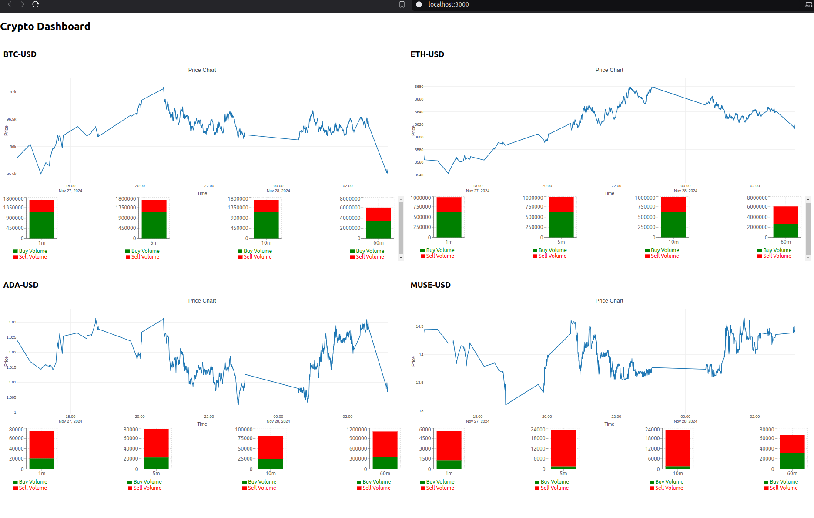

# Crypto Dashboard

## Project Overview

The **Crypto Dashboard** is a full-stack application designed to provide real-time updates and visualizations of cryptocurrency market data. It includes features such as line graphs for historical data and aggregated trade visualizations for buy/sell activity. The project is structured into three key components: the frontend (`crypto-dashboard`), data acquisition (`data_acquisition`), and data serving (`data_serving`).


* * *

## Features

### Frontend

- **Responsive Dashboard:** Displays cryptocurrency data in a dynamic layout, adjusting to screen size (e.g., 2x2 grid for large screens, vertical stack for smaller screens).
- **Visualizations:**
    - Line charts for price trends.
    - Aggregated trade charts (buy/sell activity for 1m, 5m, 10m, and 60m intervals).
- **Real-Time Updates:** Periodically fetches and updates data for a seamless user experience.

### Backend

- **Data Serving (`data_serving`):**
    - Serves cryptocurrency data through RESTful API endpoints.
    - Handles data aggregation for efficient rendering on the frontend.
    - Configuration management with `config.py`.
- **Data Acquisition (`data_acquisition`):**
    - Collects and processes cryptocurrency trade data.
    - Integrates with a database for persistent storage.

### Deployment

- Uses `docker-compose` for containerized deployment, ensuring ease of setup and scalability.

* * *

## Project Structure

```bash
├── crypto-dashboard       # Frontend React application
│   ├── package.json
│   ├── package-lock.json
│   ├── README.md
│   └── src
│       ├── App.css        # Styling for the main application
│       ├── App.js         # Main React component
│       ├── App.test.js    # Unit tests for App.js
│       ├── axios.js       # Axios instance with configuration
│       ├── components     # React components
│       │   ├── AggregatedTrades.css  # Styling for aggregated trades
│       │   ├── AggregatedTrades.js   # Aggregated trades component
│       │   ├── GraphComponent.js     # Line graph component
│       │   └── TradeListComponent.js # (Deprecated) Trade list component
│       ├── index.css      # Global styling
│       ├── index.js       # Application entry point
│       └── setupTests.js  # Test setup configuration
├── data_acquisition       # Data ingestion scripts
│   ├── db.py              # Database integration
│   └── main.py            # Main entry point for data ingestion
├── data_serving           # Backend services
│   ├── api.py             # API endpoints for data serving
│   ├── config.py          # Configuration for backend services
│   └── db_utils.py        # Utility functions for database operations
├── docker-compose.yml     # Docker Compose configuration
└── private                # Private keys and environment variables
    ├── cdp_api_key.json   # API key for coin base api
    └── private.env        # Environment variables for database

```

* * *

## Getting Started

### Prerequisites

- [Node.js](https://nodejs.org/)
- [Python 3.12](https://www.python.org/)
- [Docker](https://www.docker.com/)
- [npm](https://www.npmjs.com/) or [yarn](https://yarnpkg.com/)

### Installation
#### Create Project Structure
1. Create private directory
```bash
mkdir private
```

2. Create your `.env` as referenced bo docker-compose.yml.  see `example_private.env`.  Put this in `private` directory.

3. Get your API key from Coin Base. You should be able to download `json` file like `example_cdp_api_key.json`. Put this in `private` directory.

#### Dockerized Deployment

1.  Ensure `docker-compose` is installed.
    
2.  Run:
```bash
docker-compose up --build
```    

3. Check that everything is as expected.
```bash
docker logs async_postgres
```
4.  Check that your environment variables are applied in the docker instance:
```bash
docker exec -it async_postgres bash
env | grep POSTGRES # this should show you the values in your private.env.
```

#### Populate your data
Websocket to Coin base api using `data_acquisition/main.py`.  If you have issues check your keys and the white listed IPs on the key ( including Ipv6 ). `curl ifconfig.me` to get external Ip addresses.  Careful ... this can use a lot of data over the network.  Change the `SUBS` in `data_acquisition/main.py` to your desired subscriptions. 

1. in `/data_acquisitions` 
```bash
python main.py
```
2. let this run for a few minutes.

3. Check that the database is being populated
```bash
docker exec -it async_postgres bash
psql -U crypto -d crypto
\l # show available databases
\c crypto #: connect to database
\dt # list tables
select count(td.id) from ticker_data as td; ## this should not be 0.
exit
exit
```

#### Frontend

1.  Navigate to the `crypto-dashboard` directory:
```bash
cd crypto-dashboard
```
    
2.  Install dependencies:
```bash
npm install
```
    
3.  Start the development server:
```bash
npm start
```
    
#### Backend

1.  Navigate to the `data_serving` directory:
```bash    
cd data_serving
```
    
2.  Start the API server:
```bash    
python api.py
```
3. Check with curl
```bash
curl -X GET "http://localhost:5000/api/last_trade?product_id=BTC-USD" # substitute the appropriate product_id

```


* * *

## API Endpoints

### `/api/ticker_data`

- **Method:** GET
- **Description:** Fetches historical ticker data for a cryptocurrency.
- **Parameters:**
    - `product_id` (e.g., BTC-USD)
    - `start_time` (ISO timestamp)

### `/api/aggregated_trades`

- **Method:** GET
- **Description:** Fetches aggregated trade data.
- **Parameters:**
    - `product_id` (e.g., BTC-USD)
    - `since` (ISO timestamp)

### `/api/last_trade`

- **Method:** GET
- **Description:** Fetches last trade for a product.
- **Parameters:**
    - `product_id` (e.g., BTC-USD)


### `/api/recent_trades`

- **Method:** GET
- **Description:** Fetches last `n` trades for a product.
- **Parameters:**
    - `product_id` (e.g., BTC-USD)
    - `limit` (int - number of recent to return)

* * *

* * *

## Development Notes

- **Frontend:** Built with React, styled with CSS. Designed to be responsive and lightweight.
- **Backend:** Python Flask app serving APIs. Focus on efficiency with well-optimized queries.
- **Data Flow:** Data acquisition and serving are decoupled for scalability and clarity.


* * *


